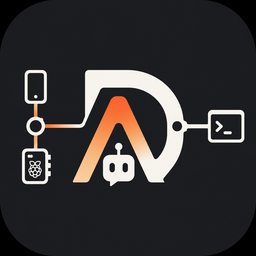

# AgentDock

<p align="center">
  
</p>

> AgentDock is an open-source **Agent Bridge / Runtime** that connects devices to agents through sessions and event streams.

AgentDock 是一个开源 **Agent Bridge / Runtime**：通过 Session 与 Event Stream 连接 Device 与任意 Agent。支持 **纯文本** 与 **语音** 双通道。

公网 Agent 接入规范：[`docs/AGENT_PROTOCOL.md`](./docs/AGENT_PROTOCOL.md)（协议标识 `agentdock.agent/1.0`）。

统一客户端 UI：

```bash
python clients/cli/main.py --ui
# 点击通话开始收音，再点结束
```

## 目录（按功能）

```text
runtime/          # 后端服务（Python 包）：协议、会话、Agent 适配、STT/TTS、网关
clients/          # 瘦终端（只连 WS；不算模型）
  web/            # 桌面预览 UI（人物图从 Runtime :8766/pets 下载缓存）
  cli/            # 启动 Web UI + CLI 调试
  rpi/            # 树莓派随身终端
  mobile/         # Flutter 手机 App
  shared/         # 协议 / 状态机 / TurnView
agents/           # 本地安装 / 联调外部 Agent（demo + pi-coding + check_link）
catalog/          # 能力声明（agent / tts / stt）
assets/
  brand/          # 项目图标（入库；python scripts/generate_brand_icons.py）
  pets/           # 本机角色包（gitignore；仓库仅 README）
  voices/         # 本机音色包（gitignore；仓库仅 README）
data/             # 用户数据根（gitignore）：vault / state / logs / installs / …
docs/             # 文档
tests/            # 测试
config.yaml       # Runtime 配置（含 paths）
```

若本机还残留旧版 `workspace/`，迁到 `data/` 并删除空壳：

```bash
python scripts/migrate_workspace_to_data.py --purge
```

## 完整链路

```text
clients/*  ──WebSocket──►  runtime    ──Agent Protocol──►  外部 Agent
                              │
                         STT / TTS
                              │
clients/*  ◄──事件 + 语音────┘
```

## 快速开始

Windows：脚本只冷启动 Runtime，附属服务在 Admin 启停：

```powershell
.\scripts\start.ps1          # Runtime + 打开 http://127.0.0.1:8766/admin/
.\scripts\stop.ps1
```

Admin 会根据硬件标记推荐项；用户直接在“智能助手”和“声音”页面选择即可。
智能助手需先到官网安装官方客户端，Runtime 只检测 PATH 上是否已安装，再配置
LLM 并启动 gateway。声音引擎仍可由 Runtime 隔离安装。
每个 Agent 的模型服务、模型名称和凭据可以单独保存；也可以先配置一套统一模型，
兼容的 Agent 在设置里下拉直接选用。切换 Agent 不会互相覆盖独立配置。
当前内置国内 CLI 包括 Qwen Code、Kimi Code、CodeBuddy 和 Qoder。
也可在 `config.yaml` → `services.*.autostart: true` 让 Runtime 起来后自动拉起。

Admin UI/API 仅接受本机访问（Docker 下允许桥接 peer + `Host: localhost`）；设备仍可从局域网访问 `/pets/*` 和 `/health`。Device WS 在 `0.0.0.0` / Docker 下默认需要 token（`data/state/device-auth.json`）。Admin
设置的默认 Agent/TTS/STT 保存在 `data/state/runtime-state.json`，不会改写 `config.yaml`。
安装收据与许可证确认保存在 `data/state/module-state.json`。
Agent 的公开模型选项保存在 `data/state/agent-settings.json`；统一 LLM 与各 Agent
的引用关系也写在同一文件。凭据与公开设置分离，Windows 下使用当前系统用户的
DPAPI 加密后写入 `data/state/agent-secrets.json`。

首启与模块启停：见 [`docs/ONBOARDING.md`](./docs/ONBOARDING.md)（Admin 总览直接检查/启动 Agent · TTS · STT · 人物）。

Docker（纯 Runtime；Agent / SoVITS 在宿主机）：见 [`docs/DOCKER.md`](./docs/DOCKER.md)。

```bash
docker compose up --build -d
```

手动分步：

```bash
# Runtime（后端：设备 WS :8765 + Admin/Pets HTTP :8766）
pip install -e .
python -m runtime
# 浏览器打开 http://127.0.0.1:8766/admin/  — 服务启停 / 设备 / Agent / TTS
# 或: .\scripts\start.ps1

# Pi 网关（另一终端）
$env:PI_GATEWAY_PORT=9001; python agents/pi-coding/gateway.py

# 可选：桌面 Web 预览
python clients/cli/main.py --ui

# CLI 调试
cd clients/cli
pip install -r requirements.txt
python main.py --chat --agent pi --tts haibara
python main.py --text "帮我整理桌面的文件"
python main.py --record 5
python main.py --wav ./test.wav
```

## 接入公网 / 自建 Agent

```bash
# 参考 Agent + 链路探测（见 agents/）
python agents/demo/server.py
python agents/check_link.py --url http://127.0.0.1:8080/v1/agent/run

# config.yaml → agent.default: http
python clients/cli/main.py --text "你好" --agent http
```

安装与联调说明：[`agents/README.md`](./agents/README.md) · 协议：[`docs/AGENT_PROTOCOL.md`](./docs/AGENT_PROTOCOL.md) · [Provider 支持清单](./docs/PROVIDERS.md)。

## 默认能力

| 能力 | 默认 |
|------|------|
| STT | Whisper `small`；中文主机可切换 SenseVoice |
| TTS | Edge `zh-CN-XiaoxiaoNeural` |
| Agent | Pi；控制台会优先推荐模型无关的 OpenCode |

配置见 [`config.yaml`](./config.yaml)。跨网：[`docs/DEPLOY_TAILSCALE.md`](./docs/DEPLOY_TAILSCALE.md) · [`docs/DEPLOY_CLOUDFLARE.md`](./docs/DEPLOY_CLOUDFLARE.md)

## 终端客户端

| 客户端 | 路径 | 说明 |
|--------|------|------|
| Web UI | [`clients/web/`](./clients/web/) | 桌面预览：状态 / 回复 / 点击通话 |
| CLI | [`clients/cli/`](./clients/cli/) | `--ui` 打开 Web；`--chat` 调试 |
| 树莓派 | [`clients/rpi/`](./clients/rpi/) | 按键点开点停 / OLED |
| 手机 | [`clients/mobile/`](./clients/mobile/) | Flutter：原生麦 + `ws://主机:8765` |

```bash
cd clients/web && python -m http.server 8090
cd clients/rpi && pip install -r requirements.txt && python -m device
cd clients/mobile && flutter run   # 需本机 Flutter；多端产物见 GitHub Actions Build Clients
```

总览：[`clients/README.md`](./clients/README.md) · [`docs/DEVICES.md`](./docs/DEVICES.md) · [`docs/TECH_PLAN.md`](./docs/TECH_PLAN.md)

## 资源与署名

| 资源 | 来源 | 说明 |
|------|------|------|
| 角色（Pet） | 本机 `assets/pets/`（不入库） | 可从 [codex-pets.net](https://codex-pets.net) 等自行导入；说明：[`assets/pets/README.md`](./assets/pets/README.md) |
| TTS 音色包 | 本机 `assets/voices/<id>/`（不入库） | 权重 / wav 本机自备；说明：[`assets/voices/README.md`](./assets/voices/README.md) |
| TTS Edge | Microsoft Edge TTS | `config.yaml` 默认可选，无需本地模型 |

自定义角色 / 音色流程以 [`clients/CUSTOM_ASSETS.md`](./clients/CUSTOM_ASSETS.md) 为准。

## License

MIT
